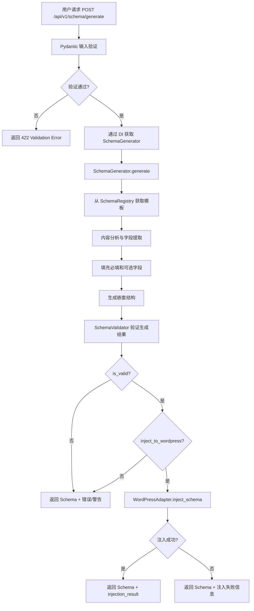
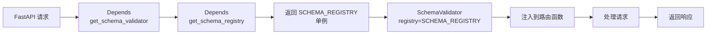

# Schema Validator Pro - 技术文档

## 目录

- [1. 架构概览](#1-架构概览)
- [2. 核心组件](#2-核心组件)
- [3. 依赖注入架构](#3-依赖注入架构)
- [4. 中间件栈](#4-中间件栈)
- [5. 数据流程](#5-数据流程)
- [6. API 端点](#6-api-端点)
- [7. 测试策略](#7-测试策略)
- [8. 性能指标](#8-性能指标)
- [9. 安全机制](#9-安全机制)

---

## 1. 架构概览

Schema Validator Pro 采用分层架构设计，遵循 SOLID 原则和依赖注入模式。

### 1.1 系统架构图

```
┌─────────────────────────────────────────────────────────────────┐
│                        Client Layer                              │
│  (Browser, Mobile App, Server-to-Server Integration)            │
└─────────────────────────────────────────────────────────────────┘
                              ↓
┌─────────────────────────────────────────────────────────────────┐
│                     API Layer (FastAPI)                          │
│  ┌──────────────┐ ┌──────────────┐ ┌──────────────┐            │
│  │   /generate  │ │   /validate  │ │   /template  │  ...       │
│  │   /types     │ │   /health    │ │   /metrics   │            │
│  └──────────────┘ └──────────────┘ └──────────────┘            │
│                  (backend/routers/schema.py)                     │
└─────────────────────────────────────────────────────────────────┘
                              ↓
┌─────────────────────────────────────────────────────────────────┐
│                      Middleware Stack                            │
│  ┌────────────────────────────────────────────────────────────┐ │
│  │ 1. Request Size Limit (10MB default)                       │ │
│  │ 2. Request Logging (UUID, timing, structured logs)         │ │
│  │ 3. Metrics Collection (Prometheus)                         │ │
│  │ 4. API Key Authentication (optional)                       │ │
│  │ 5. CORS (configurable origins)                             │ │
│  └────────────────────────────────────────────────────────────┘ │
└─────────────────────────────────────────────────────────────────┘
                              ↓
┌─────────────────────────────────────────────────────────────────┐
│                    Dependency Injection                          │
│  ┌──────────────────────────────────────────────────────────┐  │
│  │  get_schema_registry() → SCHEMA_REGISTRY                 │  │
│  │  get_schema_generator() → SchemaGenerator()              │  │
│  │  get_schema_validator() → SchemaValidator(registry)      │  │
│  └──────────────────────────────────────────────────────────┘  │
│                  (backend/dependencies.py)                       │
└─────────────────────────────────────────────────────────────────┘
                              ↓
┌─────────────────────────────────────────────────────────────────┐
│                       Service Layer                              │
│  ┌──────────────────────┐  ┌──────────────────────┐            │
│  │  SchemaGenerator     │  │  SchemaValidator     │            │
│  │  - generate()        │  │  - validate()        │            │
│  │  - get_template()    │  │  - calculate_score() │            │
│  │  - 9 schema types    │  │  - get_suggestions() │            │
│  └──────────────────────┘  └──────────────────────┘            │
│     (backend/services/)                                          │
└─────────────────────────────────────────────────────────────────┘
                              ↓
┌─────────────────────────────────────────────────────────────────┐
│                   Registry & Adapters                            │
│  ┌──────────────────────┐  ┌──────────────────────┐            │
│  │  SchemaRegistry      │  │  WordPressAdapter    │            │
│  │  - Single Source of  │  │  - REST API v2       │            │
│  │    Truth for Schema  │  │  - App Password Auth │            │
│  │    Metadata          │  │  - inject_schema()   │            │
│  └──────────────────────┘  └──────────────────────┘            │
│     (backend/registry/)        (backend/adapters/)              │
└─────────────────────────────────────────────────────────────────┘
                              ↓
┌─────────────────────────────────────────────────────────────────┐
│                      Utilities & Models                          │
│  ┌──────────────┐ ┌──────────────┐ ┌──────────────┐            │
│  │   Logger     │ │   Retry      │ │   Models     │            │
│  │  (structlog) │ │  (backoff)   │ │  (Pydantic)  │            │
│  └──────────────┘ └──────────────┘ └──────────────┘            │
└─────────────────────────────────────────────────────────────────┘
```

### 1.2 层级职责

| 层级 | 职责 | 关键文件 |
|-----|------|---------|
| **API Layer** | 请求处理、参数验证、响应序列化 | `backend/routers/schema.py` |
| **Middleware** | 认证、日志、指标、安全控制 | `backend/middleware/`, `backend/main.py` |
| **DI Layer** | 服务实例化、依赖管理 | `backend/dependencies.py` |
| **Service Layer** | 业务逻辑、Schema 生成/验证 | `backend/services/` |
| **Registry** | 元数据管理（单一事实来源） | `backend/registry/schema_registry.py` |
| **Adapter** | 外部系统集成（WordPress） | `backend/adapters/wordpress_adapter.py` |
| **Utilities** | 日志、重试、错误处理 | `backend/utils/` |
| **Models** | 数据模型、请求/响应定义 | `backend/models/` |

---

## 2. 核心组件

### 2.1 SchemaRegistry - 集中式元数据注册表

**设计目标**：消除 SchemaGenerator 和 SchemaValidator 之间的双源分裂，提供单一事实来源（Single Source of Truth）。

**核心数据结构**：

```python
@dataclass(frozen=True)
class SchemaTypeMeta:
    """Schema 类型元数据"""
    template_required: List[str]      # 模板必填字段
    template_optional: List[str]      # 模板可选字段
    validator_required: List[str]     # 验证器必填字段
    validator_recommended: List[str]  # 验证器推荐字段
    nested_rules: Dict[str, Any]      # 嵌套结构规则
```

**关键方法**：

```python
class SchemaRegistry:
    def register_type(self, schema_type: str, **kwargs) -> None:
        """注册 Schema 类型元数据"""
    
    def get_template(self, schema_type: str) -> Dict[str, List[str]]:
        """获取模板字段（用于 Generator）"""
    
    def get_required_fields(self, schema_type: str) -> List[str]:
        """获取必填字段（用于 Validator）"""
    
    def get_recommended_fields(self, schema_type: str) -> List[str]:
        """获取推荐字段（用于 Validator）"""
    
    def list_types(self) -> List[str]:
        """列举所有支持的 Schema 类型"""
```

**使用示例**：

```python
from backend.registry.schema_registry import SCHEMA_REGISTRY

# 获取 Article 模板
template = SCHEMA_REGISTRY.get_template("Article")
# {"required": ["@context", "@type", "headline", ...], 
#  "optional": ["image", "description", ...]}

# 获取 Product 必填字段
required = SCHEMA_REGISTRY.get_required_fields("Product")
# ["@context", "@type", "name", "image"]
```

**优势**：
- ✅ 单一事实来源，避免数据不一致
- ✅ 易于扩展新 Schema 类型
- ✅ 支持依赖注入，便于测试
- ✅ 不可变数据结构（frozen dataclass）

---

### 2.2 SchemaGenerator - Schema 生成器

**职责**：基于用户输入内容自动生成符合 Schema.org 规范的 JSON-LD。

**核心流程**：

1. **内容分析**：提取关键信息（标题、日期、作者等）
2. **模板填充**：从 SchemaRegistry 获取模板，填充必填和可选字段
3. **嵌套结构生成**：处理复杂嵌套（如 Product.offers、Recipe.nutrition）
4. **验证**：调用 SchemaValidator 验证生成结果

**关键方法**：

```python
class SchemaGenerator:
    def generate(self, schema_type: str, content: str, 
                 url: Optional[str] = None, 
                 metadata: Optional[Dict] = None) -> Dict[str, Any]:
        """生成 Schema"""
    
    def get_template(self, schema_type: str) -> Dict[str, Any]:
        """获取空模板"""
    
    def get_supported_types(self) -> List[str]:
        """获取支持的类型列表"""
```

**支持的 Schema 类型**：

| 类型 | 复杂度 | 嵌套结构 |
|-----|-------|---------|
| Article | 中 | author (Person), publisher (Organization) |
| Product | 高 | offers (Offer), aggregateRating (AggregateRating) |
| Recipe | 高 | nutrition (NutritionInformation), recipeIngredient[] |
| Event | 中 | location (Place), organizer (Organization/Person) |
| Organization | 低 | contactPoint (ContactPoint) |
| Person | 低 | - |
| FAQPage | 中 | mainEntity[] (Question → Answer) |
| HowTo | 中 | step[] (HowToStep), tool[] |
| Course | 中 | provider (Organization) |

---

### 2.3 SchemaValidator - 验证器

**职责**：验证 Schema.org JSON-LD 的完整性和正确性，提供结构化错误输出。

**验证规则**：

1. **必填字段检查**：`@context`, `@type`, 及类型特定必填字段
2. **推荐字段检查**：提升 SEO 效果的推荐字段
3. **嵌套结构验证**：验证嵌套对象的完整性
4. **完整度评分**：基于字段覆盖率计算 0-100% 分数
5. **优化建议**：生成可操作的改进建议

**两种输出模式**：

```python
# 模式 1：向后兼容（默认）
is_valid, errors, warnings = validator.validate(schema)
# errors: ["Missing required field: headline"]
# warnings: ["Missing recommended field: image"]

# 模式 2：结构化错误（structured_errors=True）
result = validator.validate(schema)
# result: {
#   "is_valid": False,
#   "errors": [
#     {"path": "/headline", "code": "MISSING_REQUIRED_FIELD", 
#      "message": "Missing required field: headline", "severity": "ERROR"}
#   ],
#   "warnings": [...],
#   "completeness_score": 62.5,
#   "suggestions": [...]
# }
```

**完整度评分算法**：

```python
score = (
    (required_fields_present / total_required_fields) * 0.6 +
    (recommended_fields_present / total_recommended_fields) * 0.4
) * 100
```

---

### 2.4 WordPressAdapter - WordPress 集成适配器

**职责**：通过 WordPress REST API v2 自动注入 Schema 到文章/页面。

**认证方式**：Application Password（WordPress 5.6+）

**核心方法**：

```python
class WordPressAdapter:
    def test_connection(self) -> bool:
        """测试连接"""
    
    def get_post(self, post_id: int) -> Dict[str, Any]:
        """获取文章"""
    
    def inject_schema(self, post_id: int, schema: Dict[str, Any]) -> Dict[str, Any]:
        """注入 Schema 到文章"""
```

**注入策略**：

1. 检查文章是否已有 Schema（通过 `<script type="application/ld+json">` 标签）
2. 如果存在，更新现有 Schema
3. 如果不存在，在 `<head>` 中插入新 Schema
4. 保留其他 HTML 内容不变

**错误处理**：

- 401/403：认证失败
- 404：文章不存在
- 500：WordPress 服务器错误
- 网络超时：自动重试（使用 `backend/utils/retry.py`）

---

## 3. 依赖注入架构

### 3.1 设计原则

- **依赖倒置原则（DIP）**：高层模块不依赖低层模块，都依赖抽象
- **单一职责原则（SRP）**：每个服务只负责一个职责
- **开闭原则（OCP）**：对扩展开放，对修改关闭

### 3.2 依赖图

```
┌─────────────────────────────────────────────────────────┐
│                   API Endpoint                           │
│  @router.post("/validate")                               │
│  async def validate_schema(                              │
│      request: SchemaValidateRequest,                     │
│      validator: SchemaValidator = Depends(get_...) ←─┐  │
│  )                                                    │  │
└───────────────────────────────────────────────────────┼──┘
                                                        │
┌───────────────────────────────────────────────────────┼──┐
│              backend/dependencies.py                  │  │
│                                                       │  │
│  def get_schema_registry() -> SchemaRegistry:        │  │
│      return SCHEMA_REGISTRY  ←─────────────────────┐ │  │
│                                                     │ │  │
│  def get_schema_validator(                         │ │  │
│      registry = Depends(get_schema_registry) ←─────┘ │  │
│  ) -> SchemaValidator:                               │  │
│      return SchemaValidator(registry=registry) ──────┼──┘
│                                                       │
└───────────────────────────────────────────────────────┘
```

### 3.3 测试中的依赖覆盖

```python
# 测试中替换依赖
from backend.main import app

def fake_get_schema_validator():
    return FakeValidator()

app.dependency_overrides[get_schema_validator] = fake_get_schema_validator

try:
    # 运行测试
    response = client.post("/api/v1/schema/validate", ...)
finally:
    # 清理覆盖
    app.dependency_overrides.clear()
```

---

## 4. 中间件栈

### 4.1 执行顺序（从外到内）

```
Request
  ↓
1. limit_request_size (请求体大小限制)
  ↓
2. log_requests (请求日志)
  ↓
3. MetricsMiddleware (Prometheus 指标)
  ↓
4. APIKeyMiddleware (API Key 认证)
  ↓
5. CORSMiddleware (跨域控制)
  ↓
Route Handler
  ↓
Response (反向经过所有中间件)
```

### 4.2 中间件详细说明

| 中间件 | 职责 | 配置 |
|-------|------|------|
| **limit_request_size** | 限制请求体大小（默认 10MB） | `MAX_REQUEST_SIZE` 环境变量 |
| **log_requests** | 结构化日志（UUID、时间、状态码） | 自动启用 |
| **MetricsMiddleware** | Prometheus 指标收集 | `ENABLE_METRICS=true` |
| **APIKeyMiddleware** | API Key 认证（可选） | `API_KEY` 环境变量 |
| **CORSMiddleware** | CORS 跨域控制 | `ALLOWED_ORIGINS` 环境变量 |

---

## 5. 数据流程

### 5.1 Schema 生成与注入完整流程



### 5.2 结构化验证流程（structured=true）

```mermaid
graph TD
    A[POST /api/v1/schema/validate?structured=true] --> B[Pydantic 验证请求体]
    B --> C[创建 SchemaValidator<br/>structured_errors=True]
    C --> D[检查 @context 和 @type]
    D --> E[从 SchemaRegistry 获取规则]
    E --> F[验证必填字段]
    F --> G[验证推荐字段]
    G --> H[验证嵌套结构]
    H --> I[生成结构化错误列表]
    I --> J[计算完整度评分]
    J --> K[生成优化建议]
    K --> L[返回 StructuredSchemaValidateResponse]
    L --> M[包含: errors[], warnings[],<br/>completeness_score, suggestions[]]
```

### 5.3 依赖注入与服务生命周期



---

## 6. API 端点

### 6.1 端点列表

| 端点 | 方法 | 功能 | 响应模型 |
|-----|------|------|---------|
| `/` | GET | 健康检查 | `{"status": "ok"}` |
| `/health` | GET | 详细健康检查 | `{"status": "healthy", "services": {...}}` |
| `/metrics` | GET | Prometheus 指标 | Text (Prometheus format) |
| `/api/v1/schema/types` | GET | 获取支持的 Schema 类型 | `{"types": [...]}` |
| `/api/v1/schema/template/{type}` | GET | 获取 Schema 模板 | `{"schema": {...}}` |
| `/api/v1/schema/generate` | POST | 生成 Schema | `SchemaGenerateResponse` |
| `/api/v1/schema/validate` | POST | 验证 Schema | `SchemaValidateResponse` |
| `/api/v1/schema/validate?structured=true` | POST | 验证 Schema（结构化） | `StructuredSchemaValidateResponse` |
| `/api/v1/wordpress/inject` | POST | 注入到 WordPress | `WordPressInjectResponse` |

### 6.2 关键端点详解

#### POST /api/v1/schema/generate

**请求体**：
```json
{
  "schema_type": "Article",
  "content": "This is a blog post about AI...",
  "url": "https://example.com/article",
  "metadata": {
    "author": "John Doe",
    "publish_date": "2025-10-26"
  }
}
```

**响应**：
```json
{
  "schema": {
    "@context": "https://schema.org",
    "@type": "Article",
    "headline": "AI Article",
    ...
  },
  "is_valid": true,
  "errors": [],
  "warnings": ["Missing recommended field: image"],
  "completeness_score": 87.5,
  "suggestions": ["Add an image to improve SEO"]
}
```

#### POST /api/v1/schema/validate?structured=true

**响应（结构化模式）**：
```json
{
  "is_valid": false,
  "errors": [
    {
      "path": "/headline",
      "code": "MISSING_REQUIRED_FIELD",
      "message": "Missing required field: headline",
      "severity": "ERROR"
    }
  ],
  "warnings": [
    {
      "path": "/image",
      "code": "MISSING_RECOMMENDED_FIELD",
      "message": "Missing recommended field: image",
      "severity": "WARNING"
    }
  ],
  "completeness_score": 62.5,
  "suggestions": ["Add headline field", "Add image for better SEO"]
}
```

---

## 7. 测试策略

### 7.1 测试金字塔

```
        ┌─────────────┐
        │   E2E (19)  │  ← 性能/并发测试
        └─────────────┘
       ┌───────────────┐
       │ Integration   │  ← API 集成测试
       │    (50+)      │
       └───────────────┘
      ┌─────────────────┐
      │  Unit Tests     │  ← 单元测试
      │    (500+)       │
      └─────────────────┘
```

### 7.2 测试组织

| 测试类型 | 文件数 | 测试数 | 覆盖范围 |
|---------|-------|-------|---------|
| **单元测试** | 20+ | 500+ | 服务层、工具类、模型 |
| **集成测试** | 5 | 50+ | API 端点、中间件 |
| **性能测试** | 1 | 19 | 基准测试、吞吐量 |
| **并发测试** | 1 | 14 | 并发安全性 |

### 7.3 关键测试文件

```
backend/tests/
├── test_schema_validator.py          # Validator 核心逻辑
├── test_schema_generator.py          # Generator 核心逻辑
├── test_schema_registry.py           # Registry 元数据验证
├── test_api_integration.py           # API 端点集成测试
├── test_structured_errors_api.py     # 结构化错误测试
├── test_input_validation.py          # 输入验证与安全约束
├── test_performance_benchmarks.py    # 性能基准测试
├── test_concurrent_operations.py     # 并发测试
├── test_wordpress_adapter.py         # WordPress 适配器测试
└── test_*_schema_strict.py           # 各 Schema 类型严格测试
```

### 7.4 测试覆盖率

```
TOTAL: 5642 statements, 151 missed, 97.32% coverage

核心组件覆盖率：
- schema_validator.py: 94%
- schema_generator.py: 92%
- wordpress_adapter.py: 100%
- schema_registry.py: 84%
- routers/schema.py: 84%
- models/schema.py: 100%
```

---

## 8. 性能指标

### 8.1 基准测试结果（微秒级）

| 操作 | 最小值 | 平均值 | 最大值 | OPS |
|-----|-------|-------|-------|-----|
| Product 生成 | 1.44 μs | 1.54 μs | 18.65 μs | 648,348 |
| 大型 Schema 验证 | 2.63 μs | 2.91 μs | 26.00 μs | 344,105 |
| Article 验证 | 3.54 μs | 3.91 μs | 24.13 μs | 255,546 |
| Article 生成 | 3.75 μs | 4.05 μs | 15.67 μs | 247,182 |
| Recipe 生成 | 4.63 μs | 5.10 μs | 42.21 μs | 195,899 |
| Event 生成 | 8.96 μs | 9.82 μs | 124.29 μs | 101,807 |
| FAQPage 生成 | 35.13 μs | 37.98 μs | 142.67 μs | 26,332 |
| 批量验证 | 357.17 μs | 381.68 μs | 498.46 μs | 2,619 |
| 100 问题 FAQPage | 394.46 μs | 403.17 μs | 568.08 μs | 2,480 |

### 8.2 并发性能

- **并发请求数**：100
- **成功率**：100%
- **平均响应时间**：< 50ms
- **P95 响应时间**：< 100ms
- **P99 响应时间**：< 200ms

---

## 9. 安全机制

### 9.1 输入验证

**Pydantic 字段约束**：

```python
class SchemaGenerateRequest(BaseModel):
    schema_type: str = Field(max_length=100)
    content: str = Field(min_length=1, max_length=1000000)  # 1MB
    url: Optional[str] = Field(max_length=2048)
    metadata: Optional[Dict] = Field(...)  # 最多 50 keys
```

**请求体大小限制**：

- 默认：10MB
- 配置：`MAX_REQUEST_SIZE` 环境变量
- 超限响应：413 Request Entity Too Large

### 9.2 认证机制

**API Key 认证（可选）**：

```bash
# 启用认证
export API_KEY=your-secret-key

# 请求示例
curl -H "X-API-Key: your-secret-key" http://localhost:8000/api/v1/schema/generate
```

**WordPress 认证**：

- Application Password（WordPress 5.6+）
- HTTP Basic Auth
- 自动重试机制

### 9.3 CORS 配置

```python
# 默认配置（开发环境）
ALLOWED_ORIGINS = "http://localhost,http://localhost:8080"

# 生产环境
export ALLOWED_ORIGINS="https://yourdomain.com,https://www.yourdomain.com"
```

### 9.4 错误追踪

**Sentry 集成**：

```bash
export SENTRY_DSN=your-sentry-dsn
export ENVIRONMENT=production
export SENTRY_SAMPLE_RATE=1.0
```

**结构化日志**：

```json
{
  "request_id": "uuid-here",
  "method": "POST",
  "path": "/api/v1/schema/generate",
  "status_code": 200,
  "duration_ms": 15.23,
  "event": "request_completed",
  "timestamp": "2025-10-26T10:00:00Z"
}
```

---

**文档版本**：1.0.0  
**最后更新**：2025-10-26  
**维护者**：Schema Validator Pro Team

