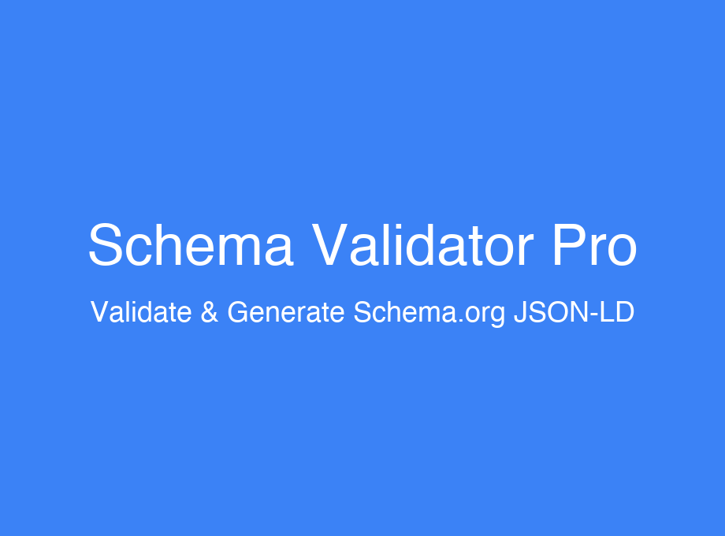

<div align="center">

# Schema Validator Pro - Browser Extension



[](https://chrome.google.com/webstore)
[](https://addons.mozilla.org/)
[](https://microsoftedge.microsoft.com/addons)
[](https://github.com/sathurn777/Schema-Validator-Pro)

A powerful browser extension for detecting and validating Schema.org JSON-LD structured data on web pages.

[Features](#-features) • [Installation](#-installation) • [Usage](#-how-to-use) • [Privacy](#-privacy)

</div>

---

## 🎯 Features

- **Auto-Detection**: Automatically detects Schema.org JSON-LD scripts on web pages
- **Real-time Validation**: Validates schemas against Schema.org specifications
- **Visual Indicators**: Badge count showing number of detected schemas
- **Detailed Reports**: Clear error and warning messages
- **Multiple Schema Types**: Supports Article, Product, Recipe, Event, Person, Organization, Course, HowTo, and FAQPage
- **Highlight Feature**: Visually highlights detected schemas on the page
- **Settings Page**: Customize detection and notification preferences

## 🚀 Supported Browsers

- Chrome (Manifest V3)
- Firefox (Manifest V3)
- Edge (Manifest V3)

## 📦 Installation

### For Development

1. Clone the repository
2. Install dependencies:
   ```bash
   pnpm install
   ```

3. Run the development server:
   ```bash
   pnpm dev
   ```

4. Load the extension in your browser:
   - **Chrome**: Navigate to `chrome://extensions/`, enable "Developer mode", click "Load unpacked", and select `build/chrome-mv3-dev`
   - **Firefox**: Navigate to `about:debugging#/runtime/this-firefox`, click "Load Temporary Add-on", and select any file in `build/firefox-mv3-dev`
   - **Edge**: Navigate to `edge://extensions/`, enable "Developer mode", click "Load unpacked", and select `build/edge-mv3-dev`

### For Production

1. Build the extension:
   ```bash
   # Build for all browsers
   pnpm build

   # Or build for specific browsers
   pnpm build:chrome
   pnpm build:firefox
   pnpm build:edge
   ```

2. The production builds will be in:
   - Chrome: `build/chrome-mv3-prod`
   - Firefox: `build/firefox-mv3-prod`
   - Edge: `build/edge-mv3-prod`

## 🛠️ Development

### Project Structure

```
browser-extension/
├── background.ts       # Background script for validation logic
├── content.ts          # Content script for schema detection
├── popup.tsx           # Popup UI component
├── popup.css           # Popup styles
├── options.tsx         # Options page component
├── options.css         # Options page styles
├── package.json        # Package configuration
└── assets/             # Extension icons
```

### Available Scripts

- `pnpm dev` - Start development server
- `pnpm build` - Build for all browsers
- `pnpm build:chrome` - Build for Chrome
- `pnpm build:firefox` - Build for Firefox
- `pnpm build:edge` - Build for Edge
- `pnpm package` - Create distribution packages
- `pnpm clean` - Clean build artifacts

## 📋 How to Use

1. **Install the Extension**: Add Schema Validator Pro to your browser
2. **Visit Any Webpage**: The extension automatically detects Schema.org JSON-LD
3. **Click the Icon**: View detected schemas and validation results
4. **Validate**: Click "Validate All" to check schemas against specifications
5. **Review**: See detailed error and warning messages
6. **Configure**: Access settings page to customize preferences

## 🔒 Privacy

Schema Validator Pro respects your privacy:
- ✅ No data collection
- ✅ No tracking
- ✅ All processing happens locally
- ✅ No external API calls

See [PRIVACY_POLICY.md](./PRIVACY_POLICY.md) for details.

## 📝 Store Listing

See [STORE_DESCRIPTION.md](./STORE_DESCRIPTION.md) for store listing information.

## 🤝 Contributing

Contributions are welcome! Please feel free to submit a Pull Request.

## 📄 License

[Your License Here]

## 🙏 Acknowledgments

Built with:
- [Plasmo Framework](https://www.plasmo.com/) - Browser extension framework
- [React](https://reactjs.org/) - UI library
- [@schema-validator-pro/core](../core) - Schema validation library

---

This is a [Plasmo extension](https://docs.plasmo.com/) project.

For more information, visit the [Plasmo Documentation](https://docs.plasmo.com/).
